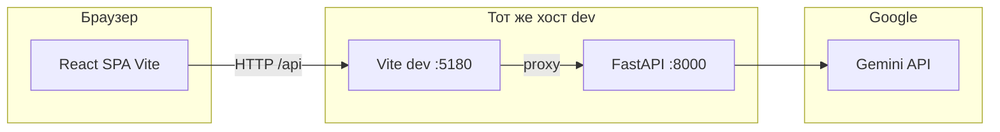

# Ingosstrakh — школа страхования для подростков

Веб-приложение для обучения основам страхования: теория, интерактивный симулятор сезонных кейсов, **личный разбор ситуации** с помощью языковой модели (через отдельный API), страница техподдержки со ссылкой на Telegram-бота. Отдельно в репозитории — **Telegram-бот** для приёма обращений (опционально).

---

## Концепция

- **Аудитория:** подростки; язык и подача адаптированы под возраст.
- **Теория:** конспекты и проверка знаний (квизы).
- **Симулятор:** выбор ответов в сценариях «сезон + страховой случай».
- **Личный разбор:** пользователь описывает свой (или шаблонный) кейс; ответ формирует **Google Gemini** на **сервере** (ключ API не попадает в браузер). При недоступности API показывается **локальный упрощённый разбор** (без вызова модели).
- **Техподдержка:** переход в Telegram-бота (URL задаётся переменной окружения при сборке).

Проект **учебный**: выводы модели и локального разбора не заменяют консультацию страховой или юриста.

---

## Архитектура



| Компонент | Технологии | Роль |
|-----------|------------|------|
| **Фронтенд** | React 18, TypeScript, Vite 5, Tailwind CSS, Framer Motion | SPA, маршрутизация по состоянию в `App.tsx` |
| **Бэкенд LLM** | Python 3, FastAPI, `google-generativeai`, Uvicorn | `POST /api/personal-case/analyze`, ключ `GOOGLE_API_KEY` только на сервере |
| **Бот** | Node.js, Telegraf | Long polling, inline-меню, опциональная пересылка оператору |

**Поток «Личный разбор»:** браузер вызывает относительный путь `/api/personal-case/analyze` → в режиме разработки Vite **проксирует** на `http://127.0.0.1:8000` → FastAPI вызывает Gemini → JSON с текстом ответа → фронт парсит и показывает риск и блоки «Понятно подростку» / «Разбор случая».

**Продакшен:** фронт собирается в статику (`npm run build`); API выкладывается отдельно; в сборке задаётся `VITE_PERSONAL_CASE_API_BASE` на публичный URL API (прокси Vite в production-сборке не используется).

---

## Структура репозитория

```
├── src/                 # React-приложение (страницы, компоненты, данные)
├── public/              # Статика
├── backend/             # FastAPI + Gemini (main.py, requirements.txt)
├── telegram-bot/        # Бот поддержки (отдельный package.json)
├── supabase/migrations/ # SQL-миграции (заготовка под БД; фронт может не использовать Supabase)
├── index.html
├── vite.config.ts       # порт 5180, proxy /api → 8000
├── package.json
└── .env.example         # шаблон переменных для фронта и бэкенда
```

---

## Требования к окружению

| Инструмент | Минимальная ориентация |
|------------|-------------------------|
| **Node.js** | LTS (18.x или 20.x+), вместе с **npm** |
| **Python** | **3.10+** (рекомендуется 3.11–3.12) |
| **Git** | для клонирования |

Дополнительно (по желанию):

- Аккаунт [Google AI Studio](https://aistudio.google.com/) — API-ключ Gemini для бэкенда.
- Бот в Telegram через [@BotFather](https://t.me/BotFather) — для `telegram-bot/`.

---

## Клонирование и первый запуск (полный сценарий)

### 1. Клонировать репозиторий

```bash
git clone <URL_репозитория>
cd <имя_папки>
```

### 2. Переменные окружения (корень проекта)

```bash
cp .env.example .env.local
```

Отредактируй `.env.local` (файл в `.gitignore`, в git не коммитить):

| Переменная | Обязательность | Описание |
|------------|----------------|----------|
| `GOOGLE_API_KEY` | Для ответов Gemini | Ключ из Google AI Studio; читает **backend** из корня `.env.local` или `backend/.env` |
| `GEMINI_MODEL` | Нет | Модель, по умолчанию в примере `gemini-flash-latest`; у разных моделей разные лимиты free tier |
| `VITE_PERSONAL_CASE_API_BASE` | Нет | Базовый URL API **без** завершающего `/`. Пусто = тот же origin, в dev Vite шлёт `/api` на прокси → 8000. **С телефона в LAN:** `http://<IP_компьютера>:8000` |
| `VITE_SUPPORT_TELEGRAM_BOT_URL` | Нет | Ссылка на бота, например `https://t.me/YourBot` |

Дублировать `GOOGLE_API_KEY` можно в `backend/.env` — порядок загрузки в `backend/main.py`: корневой `.env`, корневой `.env.local`, `backend/.env` (с `override`).

### 3. Фронтенд

```bash
npm install
npm run dev
```

В терминале появится строка вида **`Local: http://localhost:5180/`** (порт по умолчанию **5180**, см. `vite.config.ts`). Открой этот URL в браузере.

Команды:

| Команда | Назначение |
|---------|------------|
| `npm run dev` | Режим разработки (HMR) |
| `npm run build` | Сборка в `dist/` |
| `npm run preview` | Просмотр сборки (порт по умолчанию **4180**, прокси `/api` на 8000 — API должен быть запущен отдельно) |
| `npm run lint` | ESLint |
| `npm run typecheck` | Проверка TypeScript без emit |

**Зависимости фронта** подтягиваются из `package.json` (React, Vite, Tailwind, Framer Motion, Lucide и т.д.). Пакет `@supabase/supabase-js` может присутствовать в зависимостях как задел под будущую интеграцию; текущий UI к Supabase в коде страниц не обязан обращаться.

### 4. Бэкенд (обязателен для «Личного разбора» через Gemini)

В **отдельном** терминале:

```bash
cd backend
python3 -m venv .venv
source .venv/bin/activate    # Windows: .venv\Scripts\activate
pip install -r requirements.txt
uvicorn main:app --reload --host 0.0.0.0 --port 8000
```

Зависимости Python перечислены в `backend/requirements.txt` (FastAPI, Uvicorn, `google-generativeai`, `python-dotenv`, Pydantic).

Полезные URL:

- `http://127.0.0.1:8000/docs` — Swagger.
- `GET /api/personal-case/health` — `{"configured": true|false}` (есть ли ключ в окружении процесса).

### 5. Telegram-бот (опционально)

```bash
cd telegram-bot
npm install
cp .env.example .env
```

В `telegram-bot/.env`:

- `TELEGRAM_BOT_TOKEN` — от BotFather;
- `SUPPORT_OPERATOR_CHAT_ID` — опционально, куда пересылать тексты пользователей.

Проверка токена:

```bash
npm run check-token
```

Запуск:

```bash
npm start
```

Процесс должен оставаться запущенным; в логе — `polling started` и `@username` бота.

---

## Сводка: что запускать одновременно для полного функционала

| Процесс | Команда | Порт (по умолчанию) |
|---------|---------|----------------------|
| Фронт | `npm run dev` (из корня) | **5180** |
| API LLM | `uvicorn main:app --reload --host 0.0.0.0 --port 8000` (из `backend/`) | **8000** |
| Бот | `npm start` (из `telegram-bot/`) | исходящие запросы к Telegram |

Без бэкенда страница «Личный разбор» отработает с **локальным упрощённым разбором** (без Gemini). Без бота сайт работает; страдает только сценарий «Техподдержка → Telegram».

---

## Переменные окружения (шпаргалка)

Файл-образец: **`.env.example`** в корне. Реальные секреты — только в **`.env.local`** (корень) и **`backend/.env`** / **`telegram-bot/.env`**, не коммить.

---

## Лимиты Gemini (429)

На бесплатном тарифе Google действуют **квоты по моделям** (часто десятки запросов в сутки). При **429** подожди, смени `GEMINI_MODEL` на другую модель в `.env`, или подключи биллинг. Официально: [Gemini API rate limits](https://ai.google.dev/gemini-api/docs/rate-limits).

---

## Устранение типичных проблем

1. **Вместо сайта курса открывается bolt.diy или другой интерфейс на localhost**  
   Очисти данные сайта для старого порта в браузере (Application → Clear storage) или открой в инкогнито. В проекте Vite по умолчанию слушает **5180**, чтобы реже пересекаться с кэшем других приложений на 5173–5174.

2. **Несколько строк `Network:` в логе Vite**  
   Это разные IP-интерфейсы одного Mac; для работы на компьютере достаточно **Local**. Для телефона в той же Wi‑Fi — используй **Network**-URL фронта и задай `VITE_PERSONAL_CASE_API_BASE` на IP компьютера с портом **8000**.

3. **503 / нет ответа модели**  
   Проверь, что Uvicorn запущен и `GOOGLE_API_KEY` виден процессу (перезапуск после правки `.env`). В IDE иногда в окружении задана пустая `GOOGLE_API_KEY` — в коде бэкенда включён `load_dotenv(..., override=True)`, чтобы значения из файлов перекрывали окружение.

4. **Бот не отвечает**  
   См. раздел про бота: webhook должен быть пустым, токен и чат с ботом должны совпадать с логом `getMe`.

---

## Деплой (кратко)

- **Фронт:** статика из `dist/` на любой CDN/хостинг статики; при сборке задать `VITE_PERSONAL_CASE_API_BASE` и `VITE_SUPPORT_TELEGRAM_BOT_URL`.
- **API:** хостинг с Python (или контейнер), переменные `GOOGLE_API_KEY`, `GEMINI_MODEL`, CORS при необходимости ограничить доменом фронта.
- **Бот:** долгоживущий процесс `node bot.js` или аналог; для webhook-подхода текущий `bot.js` рассчитан на **polling** (webhook в коде снимается при старте).

---

## Лицензия и вложения

Уточни лицензию в репозитории (файл `LICENSE`), если публикуешь проект открыто. Не публикуй реальные API-ключи и токены бота.
